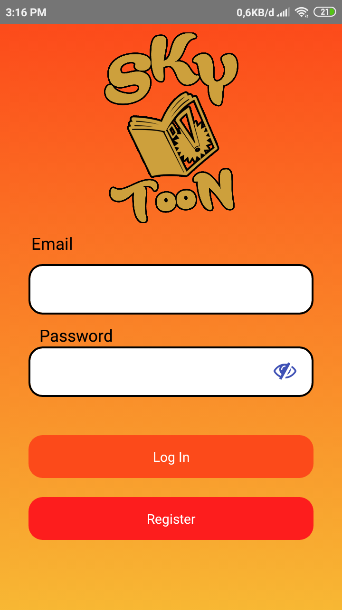
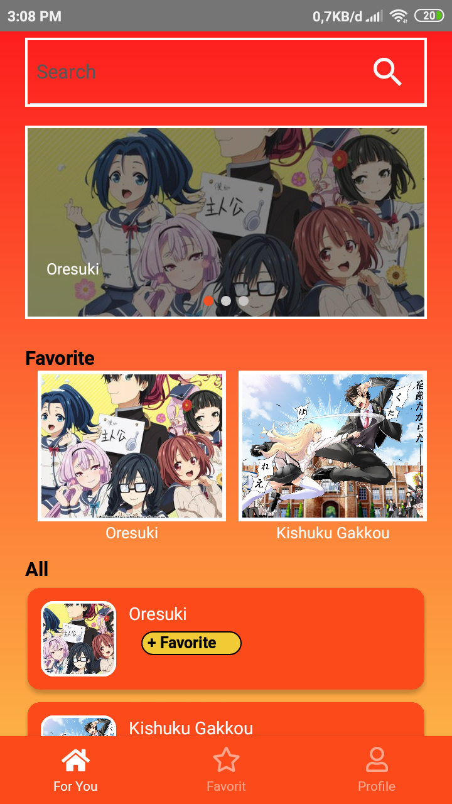
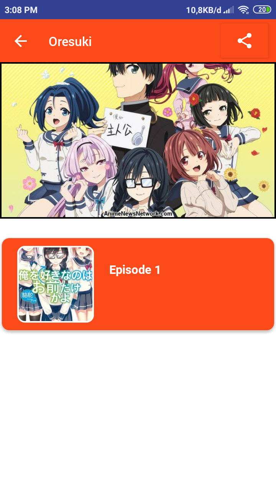
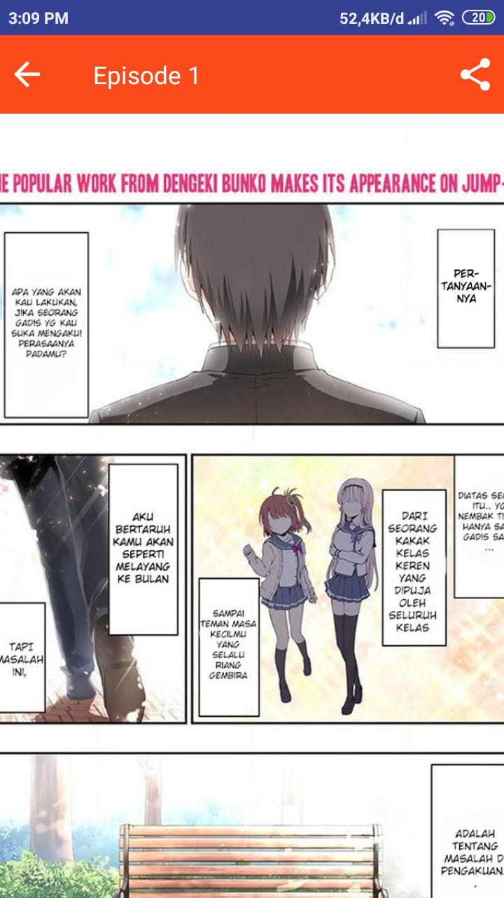
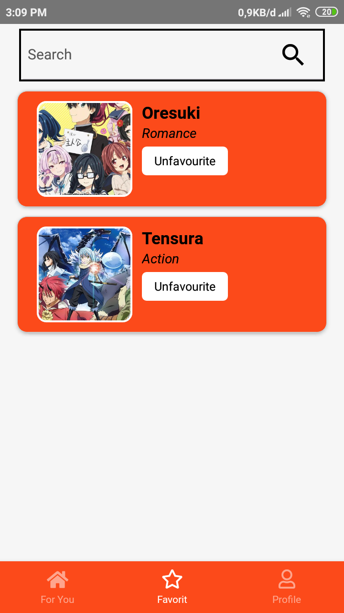
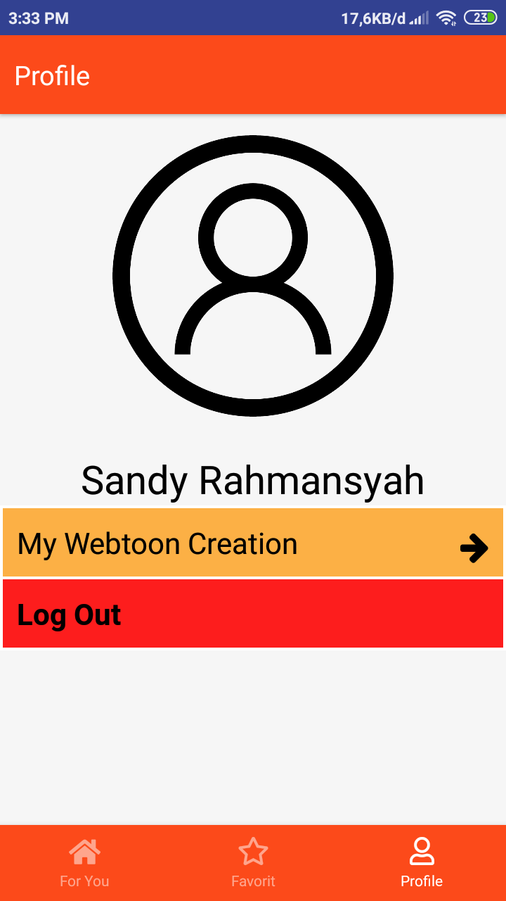
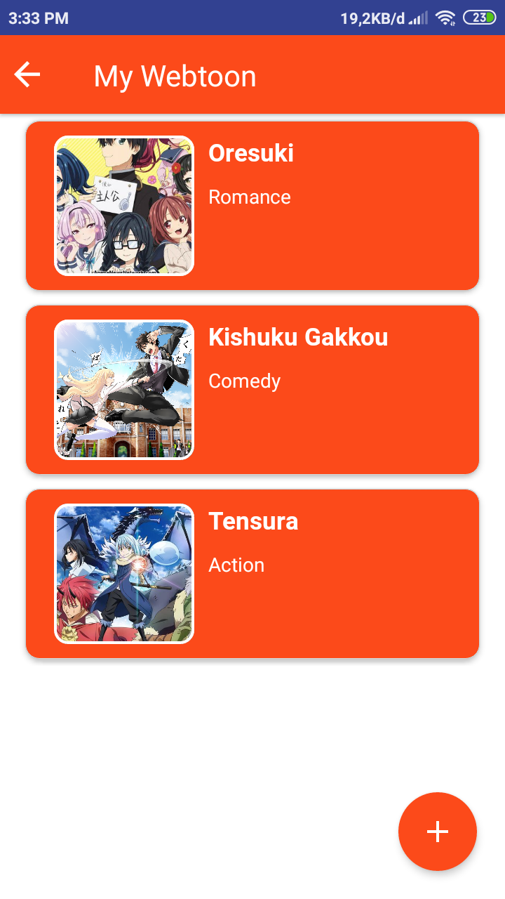
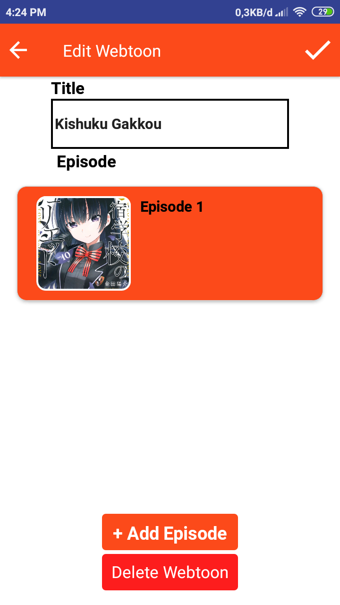

# Project-SKYTOON

<h1 align="center">
  <br>
</h1>

## Important
This project is still on very early development stage. If you want to use for production, use it with your own risk.
<br>More feature Coming Really Soon.


## Screenshots

<p float="left">
  
  
  
  
  
  
  
  
</p>


## Features
* Read Comic Online
* Read Offline (Soon)
* Add Favourite Comic
* Create Webtoon
* etc.


## Tech Stack
* React Native for the Mobile Frontend
* Express JS as the Backend


## Installation & Configuration
Follow these step to install

**Frontend:**
```
$ git clone https://github.com/sandyadzim/Project-SKYTOON
$ npm install
$ react-native run-android #for android
```


**Back-end:**
```
$ repository toon-api

```

## Support Me :)
* Star this repository :star:
* Hire Me https://www.linkedin.com/in/sandy-rahmansyah-578322128/

## Kontak 
* WA/TELEGRAM: +62 812 5556 7024
* email: sandy.adzim@gmail.com

## Download Aplikasi
 (Belum Tersedia)

----
